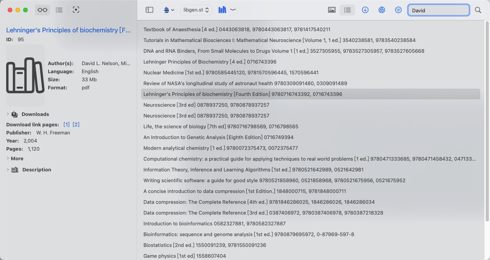

# Introduction
MacOS client for library gensis.  
Pure swift implementation.  
Enjoy the smooth experience of Aqua.  
**Inform: Download needs access to ~/Downloads folder.(But you can change default location in settings)**

# So, what can this app do?

1. Display available books on libgen.  
2. Search books from libgen, currently support column filter and formart filters.  
3. Obviously, download.  
4. That's it, maybe suport more features in future(.e.g, directly preview before download?)

# Usage

## Main window

## Books list

As you see, once startup this app or search sth, a list of books will be displayed, you can choose 2 display mode:

1. Cover mode:

   

2. List mode:

   

**When you scroll to bottom, you can click more to query books of next page.**

## Details

When you select a book from list, you can see its details info in left panel, like this:

On top is three mode to display details panel: complex/common/simple, choose what you like.

## Download

Select one book or multi books, and select download these books in context menu:

You can see these downloads by press download button in toolbar:

In fact you can redownload in context menus if download process failed:

You can pause and resume too:

At this point, resume just redownload entire file, maybe support real resume in future.

## Search

By default if you don't set filters, it will search all columns and return books that contains the search string, for example:

Here we search for 'hello':

And if we want to search someone's books, .e.g David, we could set column filters to Author and type David in search bar:

What if we want to search Bender's all books that format is djvu? Just set the format filter too:

Also, you can select multi formats, so you can search Bender's both djvu and pdf books:

Maybe you have noticed there's a weird num sequences, in fact this is used for decided how much books is quried and returned, as you see, there is 25, 50, and 100, **don't recommend to set this to 100, although it supports, you could be blocked as you send too much requests to libgen.**

## Bookmarks

By click following menu, you can add(or remove it if it already is) bookmarks persistently:

You can see bookmarks by click this button:

## 

