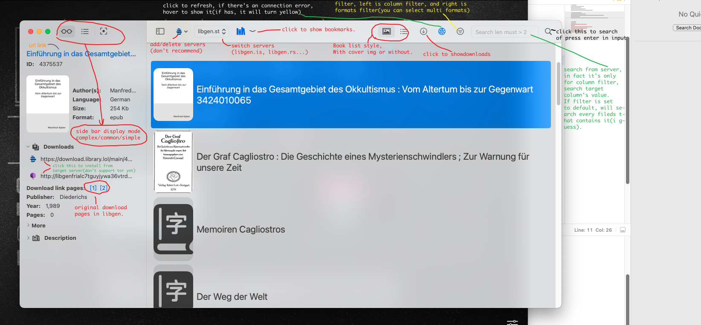
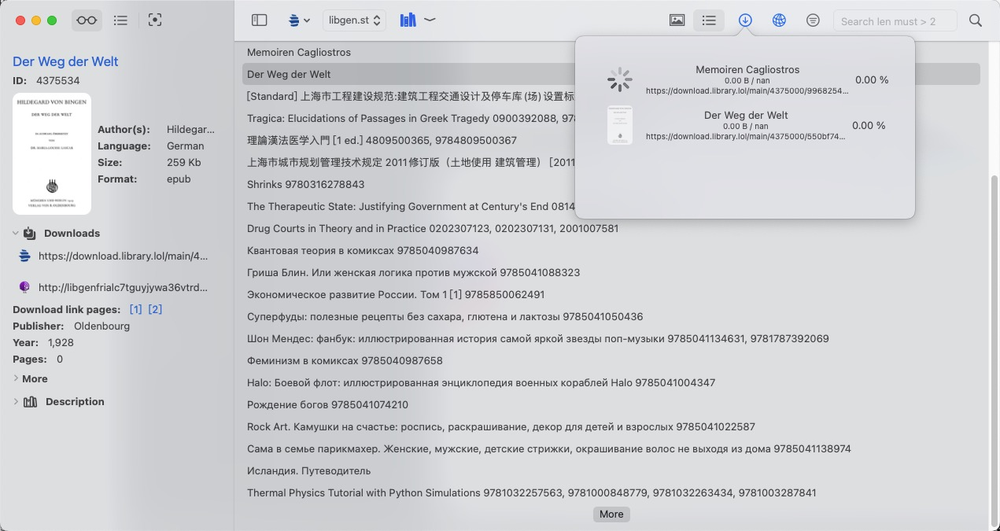

# Introduction
MacOS client for library gensis.  
Pure swift implementation.  
Enjoy the smooth experience of Aqua.  
**Inform: Download needs access to ~/Downloads folder.**

# So, what can this app do?
1. Display available books on libgen.  
2. Search books from libgen, currently support column filter and formart filters.  
3. Obiviously, download.  
4. That's it, maybe suport more features in future(.e.g, directly preview before download?)

## Screenshots
Main window:  

Download:  

Here is search and filters:    

